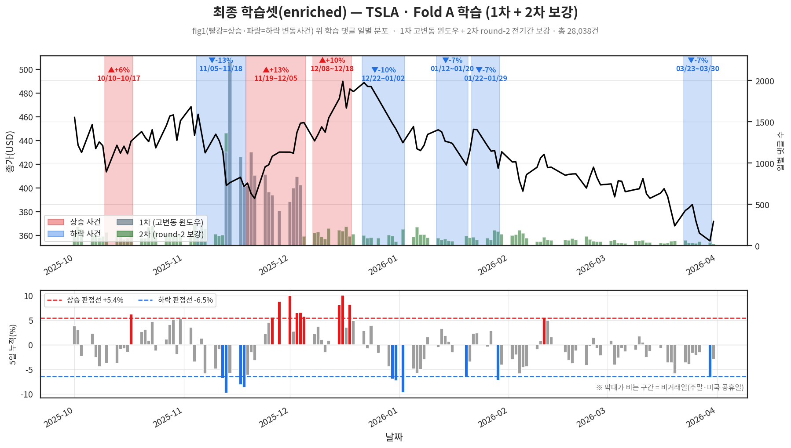
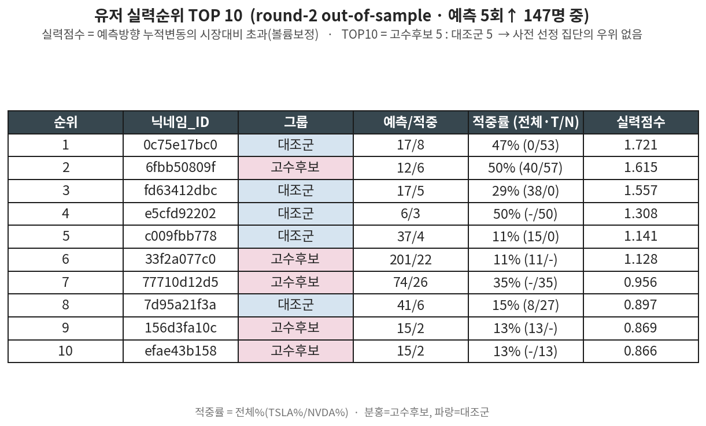

# 최종 학습셋 정책 (Fold A: TSLA학습→NVDA평가)

> **결정**: 별도 학습셋을 새로 만들지 않는다. 2차(round-2)로 C2/C3를 보강한 **enriched 학습셋을 그대로** 쓰고, **평가셋은 자연분포**(nvda_eval)로 둔다. 비중↑은 학습 시 **손실가중(class weight)**으로 처리.
> 선행 문서: [[labeling.md]](1차) · [[labeling_consistency.md]](2차/일관성) · `consistency_ranking.py`

---

## ⚡ 한눈에 (오해 방지)
| 항목 | 최종 | (검토 후) 폐기된 것 |
|---|---|---|
| 학습셋 | **`tsla_train_enriched_final`**(1차+round-2 TSLA, 적중969) 그대로 | ❌ CAP/oversample 별도 빌드(`build_train_set.py`) — 군더더기, 삭제됨 |
| 평가셋 | **`nvda_eval_final`** 자연분포(불가침) | ❌ 평가셋 손대기 |
| 라벨 단위 | **댓글 Class(0~3)** | ❌ 사람="고수/일반" 라벨 |
| 비중↑ 방법 | **손실가중(class weight)** | ❌ 복제(특히 C3 복제) |
| 누수방어 | 교차종목(TSLA→NVDA) + user-disjoint(13명 제거, 적용완료) | ❌ round-2 NVDA를 학습에 섞기(교차종목 깨짐) |
| 고수 TOP10 | **발표 언급만**(부록 A) | ❌ 학습 데이터로 사용 |

- **이미 `train_colab.py` FOLDS["A"]가 위 구성** → 코드 변경 불필요.
- **남은 한계**(반드시 명시): 평가셋에 **하락 적중 0건** → "하락 적중 감별"은 미검증(§3-2).

---

## 0. ★ 핵심 원칙 — 라벨 단위는 "사람"이 아니라 "댓글"
- 메인 학습셋은 **댓글 단위 Class(0/1/2/3) 그대로.** 사람을 "고수/일반"으로 라벨하지 않는다.
- "고수 비율↑"의 실제 구현 = **2차(round-2)에서 적중(C2·C3) 댓글이 늘어난 것**을 학습에 포함하는 것. ≠ "고수인 사람의 모든 댓글 통째".
- TOP10 예비고수(부록 A)는 **학습에 쓰지 않는다. 발표에서 언급만** 한다(운/실력 분석 결과).

---

## 1. 학습/평가 구성 (확정)
| | 파일 | 내용 |
|---|---|---|
| **학습** | `tsla_train_enriched_final.csv` | 1차 `tsla_train` + 2차 `expert_control`의 **TSLA분**. 28,038건 / 적중 969(C2 909·C3 60). 자연 대비 적중↑(C2 608→909, C3 35→60). |
| **평가** | `nvda_eval_final.csv` | NVDA 자연분포(적중 10.2%). **손대지 않음.** |

- `lib/train_colab.py` FOLDS["A"]가 이미 이 구성 → **추가 빌드 불필요.**
- 비중↑은 학습 손실가중(class weight / focal)으로. **복제(replication) 안 함**(특히 C3 수십 건 복제는 과적합).
- (폐기) 별도 CAP/oversample 빌드(`build_train_set.py`)는 군더더기로 판단해 삭제. round-2 자체가 보강 목적이었으므로 enriched면 충분.

**최종 학습셋 커버리지** (fig1 변동사건 위 학습 댓글 일별 분포 — 1차 고변동 윈도우 + 2차 round-2 전기간 보강):

### 왜 "round-2만"이 아니라 "1차+round-2"인가
round-2는 1차에 *더하는* 보강분. round-2 TSLA만 떼면 적중 326건으로 **오히려 줄어**(1차 적중 643건 버림) → 보강 목적과 반대. 그래서 둘을 합친 enriched(969 적중)를 쓴다.

---

## 2. 대전제 (절대 어기면 가짜 성능)
1. **학습만 비율 조정(손실가중), 평가는 자연분포.** enriched는 *train*에만. NVDA 평가셋은 자연 클래스분포 유지.
2. **방향별로 쪼개서 검증** — §3-2 참조(단, 평가셋 하락 적중 0건 한계).
3. **shortcut 점검** — user-disjoint(이미 적용) + ablation(텍스트만 vs +주주여부).

---

## 3. 검증 프로토콜 (학습 후 — 안전장치 회수)
1. **평가는 NVDA 자연분포 유지** — macro-F1 / 클래스별 PR / 4×4 혼동행렬.
2. **방향분리 C2 성능 — ⚠️ 평가셋에 하락 적중 0건 (측정 제한, 정직한 한계)**:
   - NVDA 평가셋: **C2 317·C3 56건이 전부 상승**, **하락-C2/C3 = 0건**(NVDA 상승장).
   - → 이 평가셋으론 **상승-C2만 측정 가능**, *하락 적중 감별*은 **데이터 0건으로 미검증.** "진짜 적중 감별 vs 상승론자 말투(상승장)"를 NVDA로는 **분리 불가** → 발표에 한계로 명시.
   - 학습 풀엔 하락-C2 **128**·C3 **8**건 있어 모델이 **배울 수는** 있음(검증을 못 할 뿐).
   - 하락 적중을 제대로 검증하려면 **Fold B(TSLA 평가, 하락 표본 보유)** 필요 → 후속과제.
   - (운/실력 분석의 상승편향 문제와 동일한 뿌리: 단일 상승장에선 방향·실력·시장이 교란됨)
3. **shortcut 점검** — (a) user-disjoint 확인: TSLA 학습풀 ∩ NVDA 평가 유저 = **13명/117건**, enriched에서 **이미 제거**됨 (Fold A는 평가셋 불가침 → 학습셋에서 제거하는 단방향) (b) ablation: `텍스트만` vs `텍스트+[주주]/[비주주]` macro-F1 차로 무엇으로 맞히는지 분해.
4. **기준선 대비** — 다수클래스(0.231)·TF-IDF+LR(0.323)와 비교해 모델 실익 판정.

> **Fold B**(NVDA학습→TSLA평가)를 후속으로 돌릴 경우: user-disjoint를 **대칭으로**(학습셋 NVDA에서 TSLA 평가 유저 제거), 하락 적중 검증도 그때 가능.

---

## 부록 A — TOP10 예비고수 (발표 언급용, 학습 기준 아님)
> `consistency_ranking.py`의 **운 vs 실력** 분석 결과. 학습셋과 **무관**. 발표에서 "왜 사람 기반 enrich를 안 했나"의 근거로만 사용.

### A-0. ⚠️ 용어 오해 금지 — "고수후보" ≠ "실력점수 고수(TOP10)"
**서로 다른 두 개념이다. 혼동 금지.**
| | ① 고수후보 (round-2 그룹라벨) | ② 실력점수 고수 (TOP10) |
|---|---|---|
| 정의 | **1차(round-1)에서 적중(C2/C3) ≥2건** 이던 유저 | **round-2에서 실력점수를 상대적으로 재서** 측정한 상위 10명 |
| 측정 데이터 | 1차 (선정용·in-sample) | 2차 (검증용·out-of-sample) |
| 인원 | 130명 (대조군 130명과 짝) | 10명 |
- 둘은 **측정 기준도 데이터도 다르다.** ①은 *선정 라벨*, ②는 *별도로 잰 성과 순위*.
- → **실력점수 고수(②)에는 round-2의 `대조군`도 포함된다.** 실제 TOP10 중 **5명이 대조군**(1·3·4·5·8위). "고수후보=고수, 대조군=하수"가 아니라, **1차에서 적중 적었던 대조군이 2차 실력점수에선 오히려 상위**라는 게 핵심(= 사전 선정의 우위 없음, 운 결론).
- 즉 표의 `그룹` 컬럼(고수후보/대조군)은 ①의 라벨일 뿐, ②(실력 순위)와 일치하지 않는다.

### A-1. round-2 실력순위 TOP10
순위 = 실력점수 `초과합/(예측수+EB_K=20)`, 실현변동=예측방향 누적변동(시장기저 TSLA −0.18%/NVDA +0.17% 차감), MIN_PRED=5, 순위대상 147명(고수후보 72/대조군 75).

*(그림: `6_skill_check/fig_skill_top10.py` 생성)*

| 순위 | 닉네임_ID | 그룹 | 예측/적중 | 적중률(T/N) | 실력점수 |
|---|---|---|---|---|---|
| 1 | 0c75e17bc0 | 대조군 | 17/8 | 47%(0/53) | 1.721 |
| 2 | 6fbb50809f | 고수후보 | 12/6 | 50%(40/57) | 1.615 |
| 3 | fd63412dbc | 대조군 | 17/5 | 29%(38/0) | 1.557 |
| 4 | e5cfd92202 | 대조군 | 6/3 | 50%(-/50) | 1.308 |
| 5 | c009fbb778 | 대조군 | 37/4 | 11%(15/0) | 1.141 |
| 6 | 33f2a077c0 | 고수후보 | 201/22 | 11%(11/-) | 1.128 |
| 7 | 77710d12d5 | 고수후보 | 74/26 | 35%(-/35) | 0.956 |
| 8 | 7d95a21f3a | 대조군 | 41/6 | 15%(8/27) | 0.897 |
| 9 | 156d3fa10c | 고수후보 | 15/2 | 13%(13/-) | 0.869 |
| 10 | efae43b158 | 고수후보 | 15/2 | 13%(-/13) | 0.867 |

### A-2. 왜 사람 기반(고수 N명)을 학습에 안 썼나 (데이터)
- **쏠림**: TOP10 round-2 댓글 1,733건 중 `33f2a077c0` 혼자 45%, 상위 2명 61% → 사람 통째 넣으면 그 사람 말투를 외움.
- **누수**: TOP10 중 2명이 NVDA 평가셋에도 존재.
- **실력 비유의**: 고수후보 vs 대조군 실력점수 p=0.665(대조군이 오히려↑)·적중률 p=0.085. TOP10이 5:5 → 사전 실력집단 우위 없음. "사람=고수"는 근거 박약.
- **결론**: 사람 단위 enrich는 운/말투를 학습 → 폐기. 댓글 단위 C2/C3 보강(enriched) + 손실가중으로 간다.

### A-3. 출처 참고 (고수후보/대조군·147명 깔때기)
- 선정(`sample_round2.py`): 1차 기준 고수후보=적중 C2/C3≥2(130) / 대조군=예측≥2 & 적중≤1 중 무작위 130.
- 깔때기: round-2 235명 → 예측+R_dir 206 → 예측5회↑ 147(MIN_PRED=5). 상세 [[labeling_consistency.md]] §3.
