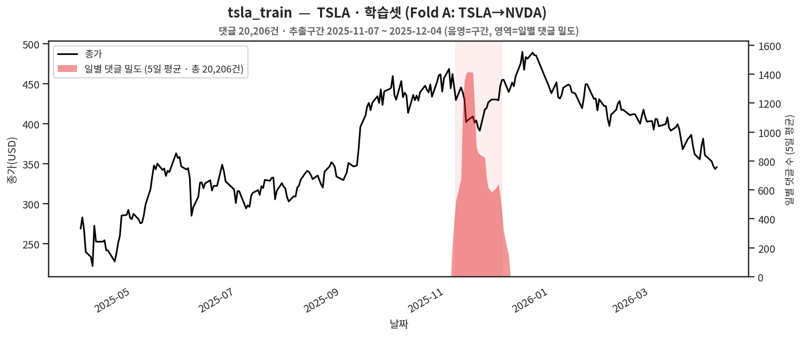
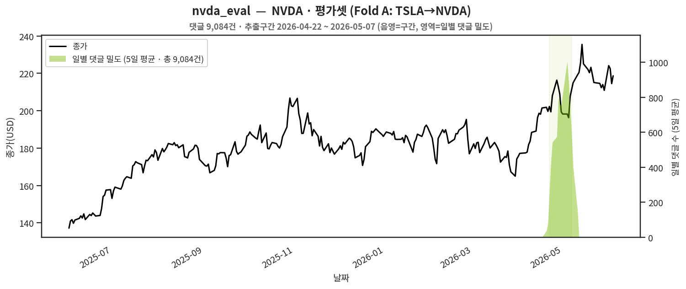
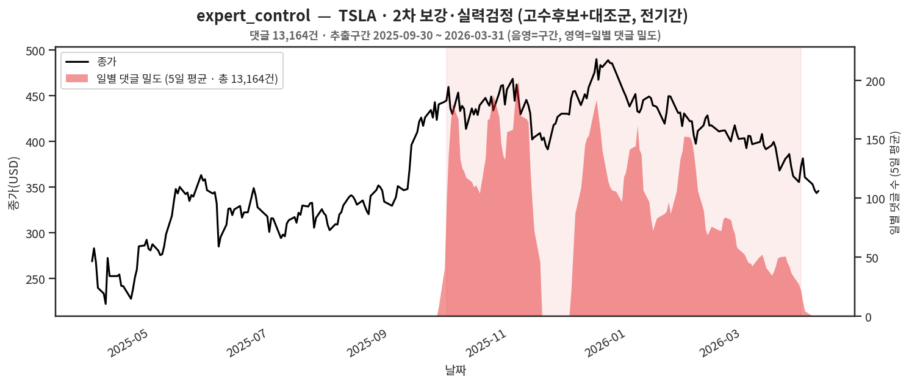
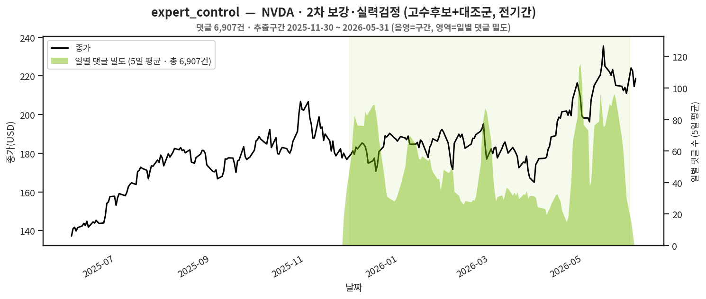
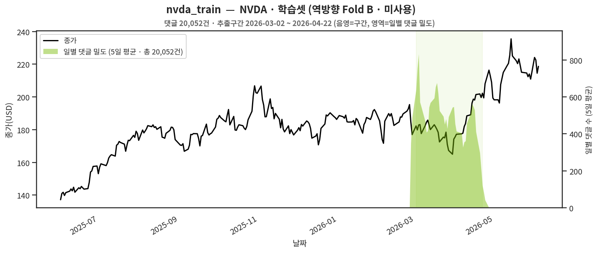
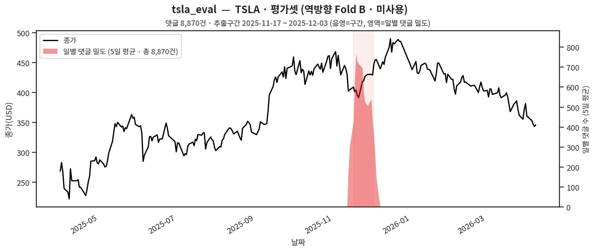

# unlabeled splits — 추출 구간 설계 설명서

> 각 split이 **종가 그래프 위 어느 구간/시점**에서 추출됐는지 그림과 함께 정리.
> 그림 생성: `2_eda/fig_splits_coverage.py` (이 폴더의 CSV를 그대로 읽어 재생성 가능).
> 모든 CSV는 **HMAC `닉네임_ID`만** 포함(실제 닉네임 없음).

## 추출 원칙
- **고변동 구간 우선**: 댓글이 몰리고 방향이 분명한 구간을 골라 예측/적중 신호를 키움.
- **교차종목(Fold A)**: TSLA에서 학습 → NVDA에서 평가 (다른 종목 일반화 + 누수 방어).
- **user-disjoint**: 학습 유저가 평가셋에 등장하지 않도록 분리.

## split 목록
| split | 종목 | 건수 | 추출구간 | 역할 |
|---|---|---|---|---|
| `tsla_train` | TSLA | 20,206 | 2025-11-07~12-04 | **Fold A 학습** |
| `nvda_eval` | NVDA | 9,084 | 2026-04-22~05-08 | **Fold A 평가**(자연분포) |
| `expert_control` | TSLA+NVDA | 20,071 | 전기간(2025-09~2026-05) | **2차 보강·실력검정**(고수후보+대조군) |
| `역방향_미사용/nvda_train` | NVDA | 20,052 | 2026-03-02~04-23 | 역방향 Fold B 학습 — **미사용** |
| `역방향_미사용/tsla_eval` | TSLA | 8,870 | 2025-11-17~12-04 | 역방향 Fold B 평가 — **미사용** |

---

## Fold A — 본편 (TSLA 학습 → NVDA 평가)
### tsla_train (TSLA 학습셋)

### nvda_eval (NVDA 평가셋 · 자연분포)

## 2차 보강 — expert_control (고수후보+대조군, 전기간 분포)
1차의 좁은 윈도우와 달리 6개월 전체에 퍼져 있음(유저당 예측 수↑ → 희소클래스 보강 + 실력 재현성 검정).

## 역방향 Fold B (미사용)
비용상 양방향 교차를 포기 → 아래 두 split은 추출만 하고 라벨링/학습에 **사용하지 않음**.

